# Chart2md

OOXML (Office Open XML) 파일에 포함된 차트를 Markdown 테이블로 변환하는 순수 Python 패키지입니다. 전통 DrawingML 차트(`c:chartSpace`)와 현대 chartEx 차트(`cx:chartSpace`)를 모두 지원하며, 외부 의존성이 없습니다.

## 설치(pip로 이용하려면)

```bash
pip install -e .
```

## 두 가지 핵심 함수

### `load_chart_parts(path)`

OOXML 파일에서 차트 XML 파트를 찾아 `(ET.Element, ZipContext)` 쌍의 목록으로 반환합니다.

- **`.pptx`**: `presentation.xml`의 `sldIdLst` 순으로 탐색하므로 슬라이드 순서가 보장됩니다.
- **`.xlsx` / `.docx`**: 슬라이드 개념이 없으므로 파일명 natural sort로 탐색합니다.

**제약:** 슬라이드 컨텍스트(어느 슬라이드의 차트인지)를 알 수 없습니다. 단독으로 차트 변환 결과를 빠르게 확인하는 용도에 적합합니다.

### `convert(root, ctx)`

차트 XML 루트 `ET.Element`를 받아 Markdown 테이블 문자열을 반환합니다. 루트 태그의 네임스페이스를 보고 전통 DrawingML 차트와 chartEx 차트를 자동으로 판별해 적절한 변환기로 디스패치합니다.

```python
from chart2md import convert, load_chart_parts

for root, ctx in load_chart_parts("presentation.pptx"):
    print(convert(root, ctx))
```

---

## CLI — 차트 변환 결과 빠르게 확인하기

`load_chart_parts()`를 사용하므로 슬라이드 순서와 관계없이 파일 안의 모든 차트를 변환해 출력합니다. 특정 파일의 차트 데이터가 어떻게 변환되는지 확인하거나 디버깅할 때 유용합니다.

```bash
chart2md input.pptx                        # 모든 차트를 stdout으로 출력
chart2md input.pptx -o output.md           # 파일로 저장
chart2md input.pptx --chart-source excel   # 전통 차트에 내장 Excel 데이터 사용
chart2md input.pptx --chartex-source xml   # chartEx 차트에 XML 사용
```

---

## Full Pipeline 통합 — PPTX 전체를 MD로 변환할 때

PPTX 전체를 슬라이드 순서대로 Markdown으로 변환하는 파이프라인을 구축할 때는 `load_chart_parts()`를 쓰지 않습니다. 대신 다음 흐름으로 직접 처리합니다.

1. `ppt/presentation.xml`의 `sldIdLst`에서 슬라이드 순서를 읽는다.
2. 각 슬라이드 XML을 순서대로 파싱하며 `p:sp`(텍스트), `p:pic`(이미지), `p:graphicFrame`(차트·표) 등 shape을 순회한다.
3. `p:graphicFrame`의 `a:graphicData[@uri]`에 `"chart"`가 포함되면 차트로 판단한다.
4. 슬라이드의 `.rels` 파일에서 `r:id`를 resolve해 차트 XML 파일 경로를 얻는다.
5. 해당 경로로 `ZipContext`를 직접 구성하고 `convert(root, ctx)`를 호출한다.

```python
from chart2md import convert, ZipContext
import xml.etree.ElementTree as ET

# shape 순회 중 차트를 만났을 때
chart_path = slide_rels[rid]                    # r:id → 경로 resolve
chart_root = ET.fromstring(zf.read(chart_path))
ctx = ZipContext(zf, chart_path)
markdown = convert(chart_root, ctx)             # 차트 타입 자동 판별
```

이 방식은 슬라이드 순서와 shape의 위치(EMU) 정보를 모두 유지하므로 reading order 적용이 가능합니다.

---

## 변환 결과 예시

좌측은 실제 프레젠테이션 슬라이드의 원본 차트이며, 우측은 본 패키지를 통해 Markdown 문법으로 변환된 결과를 렌더링한 형태입니다. 샘플 파일에 포함된 총 17개의 다양한 차트 타입에 대한 변환 결과입니다.

원본 차트 형태 | 변환된 Markdown 구문 예시
:---:|:---:
**Slide 1 (Column Chart)**<br>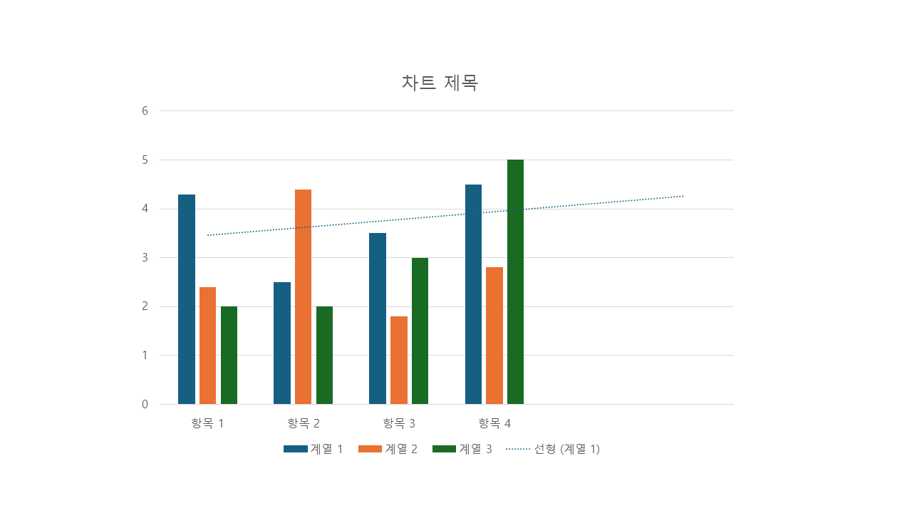 | <pre>**Chart type:** Column Chart<br><br>\|      \| 계열 1 \| 계열 2 \| 계열 3 \|<br>\| ---- \| ---- \| ---- \| ---- \|<br>\| 항목 1 \| 4.3  \| 2.4  \| 2    \|<br>\| 항목 2 \| 2.5  \| 4.4  \| 2    \|<br>\| 항목 3 \| 3.5  \| 1.8  \| 3    \|<br>\| 항목 4 \| 4.5  \| 2.8  \| 5    \|</pre>
**Slide 2 (Line Chart)**<br>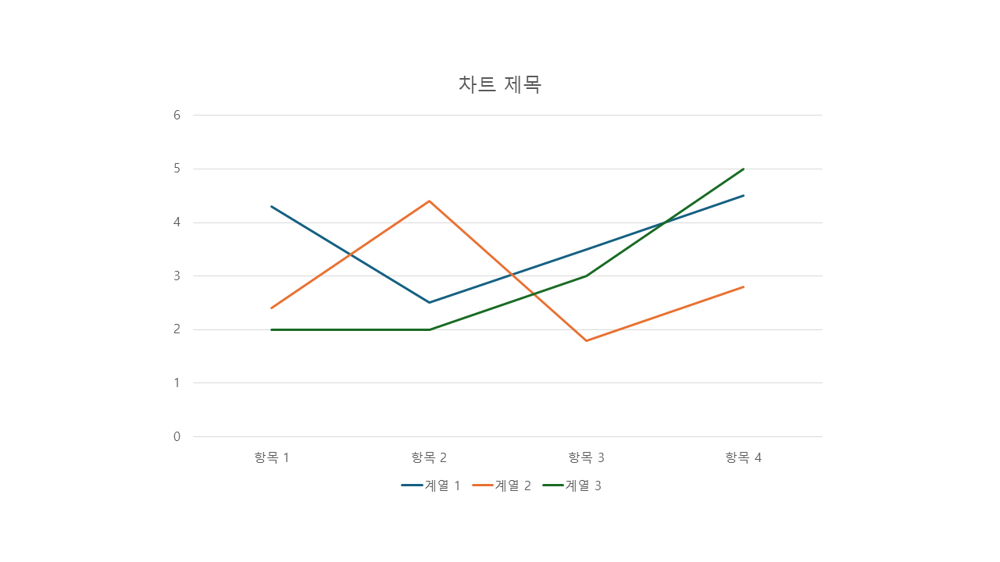 | <pre>**Chart type:** Line Chart<br><br>\|      \| 계열 1 \| 계열 2 \| 계열 3 \|<br>\| ---- \| ---- \| ---- \| ---- \|<br>\| 항목 1 \| 4.3  \| 2.4  \| 2    \|<br>\| 항목 2 \| 2.5  \| 4.4  \| 2    \|<br>\| 항목 3 \| 3.5  \| 1.8  \| 3    \|<br>\| 항목 4 \| 4.5  \| 2.8  \| 5    \|</pre>
**Slide 3 (Pie Chart)**<br>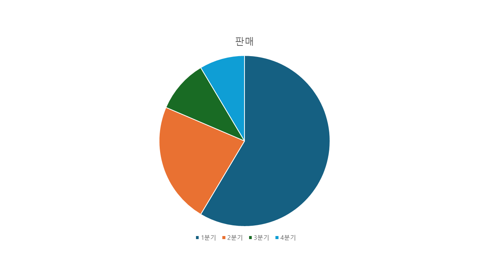 | <pre>**Chart type:** Pie Chart<br><br>\|     \| 판매  \|<br>\| --- \| --- \|<br>\| 1분기 \| 8.2 \|<br>\| 2분기 \| 3.2 \|<br>\| 3분기 \| 1.4 \|<br>\| 4분기 \| 1.2 \|</pre>
**Slide 4 (Bar Chart)**<br>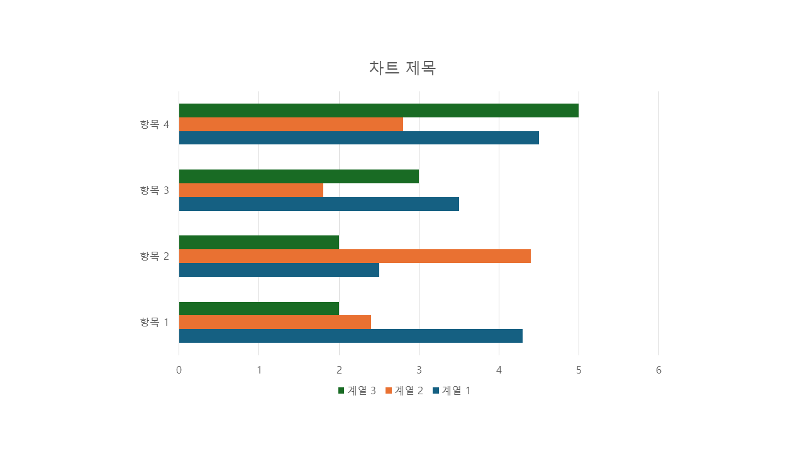 | <pre>**Chart type:** Bar Chart<br><br>\|      \| 계열 1 \| 계열 2 \| 계열 3 \|<br>\| ---- \| ---- \| ---- \| ---- \|<br>\| 항목 1 \| 4.3  \| 2.4  \| 2    \|<br>\| 항목 2 \| 2.5  \| 4.4  \| 2    \|<br>\| 항목 3 \| 3.5  \| 1.8  \| 3    \|<br>\| 항목 4 \| 4.5  \| 2.8  \| 5    \|</pre>
**Slide 5 (Area Chart)**<br>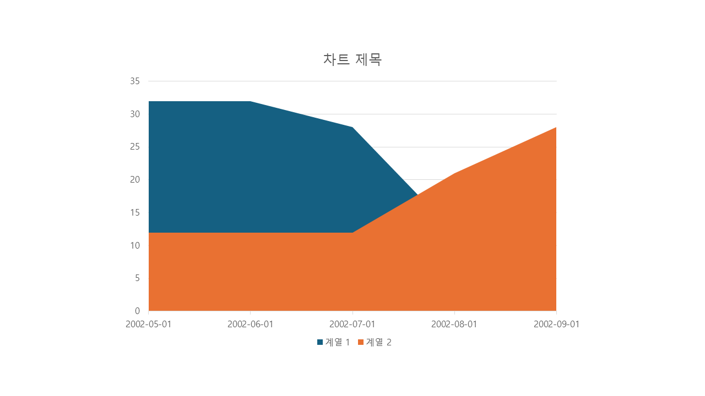 | <pre>**Chart type:** Area Chart<br><br>\|            \| 계열 1 \| 계열 2 \|<br>\| ---------- \| ---- \| ---- \|<br>\| 2002-05-01 \| 32   \| 12   \|<br>\| 2002-06-01 \| 32   \| 12   \|<br>... (생략) ...<br>\| 2002-09-01 \| 15   \| 28   \|</pre>
**Slide 6 (Scatter Chart)**<br>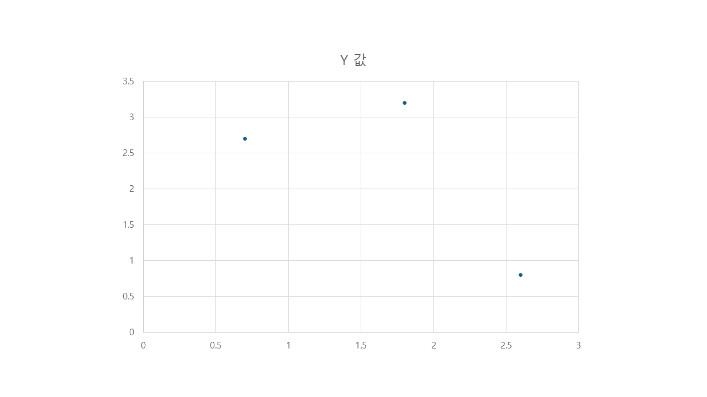 | <pre>**Chart type:** Scatter Chart<br><br>\| X   \| Y   \|<br>\| --- \| --- \|<br>\| 0.7 \| 2.7 \|<br>\| 1.8 \| 3.2 \|<br>\| 2.6 \| 0.8 \|</pre>
**Slide 7 (Region Map Chart)**<br>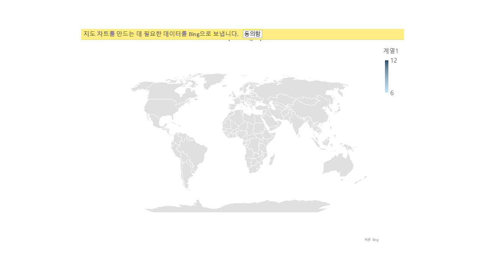 | <pre>**Chart type:** Region Map Chart<br><br>\|  \| 계열1 \|<br>\| --- \| --- \|<br>\| 미국 \| 8 \|<br>\| 멕시코 \| 10 \|<br>... (생략) ...<br>\| 나미비아 \| 11 \|</pre>
**Slide 8 (Stock Chart)**<br>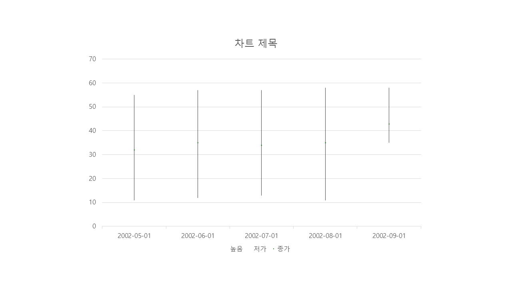 | <pre>**Chart type:** Stock Chart<br><br>\|            \| 높음 \| 저가 \| 종가 \|<br>\| ---------- \| --   \| --   \| --   \|<br>\| 2002-05-01 \| 55   \| 11   \| 32   \|<br>\| 2002-06-01 \| 57   \| 12   \| 35   \|<br>... (생략) ...<br>\| 2002-09-01 \| 58   \| 35   \| 43   \|</pre>
**Slide 9 (3-D Surface Chart)**<br>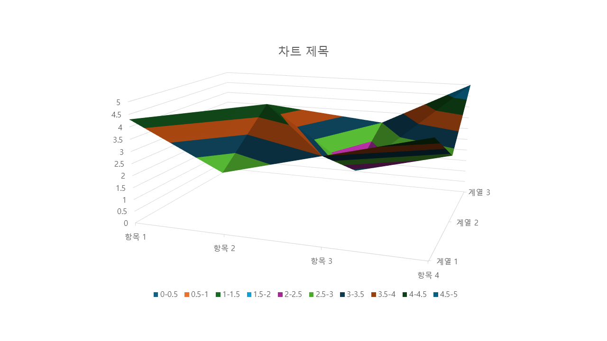 | <pre>**Chart type:** 3-D Surface Chart<br><br>\|      \| 계열 1 \| 계열 2 \| 계열 3 \|<br>\| ---- \| ---- \| ---- \| ---- \|<br>\| 항목 1 \| 4.3  \| 2.4  \| 2    \|<br>\| 항목 2 \| 2.5  \| 4.4  \| 2    \|<br>\| 항목 3 \| 3.5  \| 1.8  \| 3    \|<br>\| 항목 4 \| 4.5  \| 2.8  \| 5    \|</pre>
**Slide 10 (Radar Chart)**<br>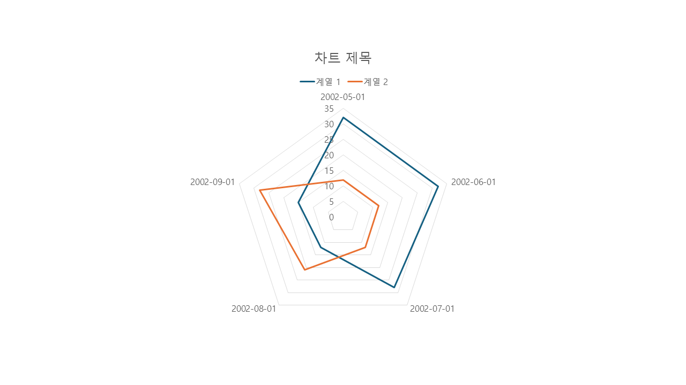 | <pre>**Chart type:** Radar Chart<br><br>\|            \| 계열 1 \| 계열 2 \|<br>\| ---------- \| ---- \| ---- \|<br>\| 2002-05-01 \| 32   \| 12   \|<br>\| 2002-06-01 \| 32   \| 12   \|<br>... (생략) ...<br>\| 2002-09-01 \| 15   \| 28   \|</pre>
**Slide 11 (Treemap Chart)**<br>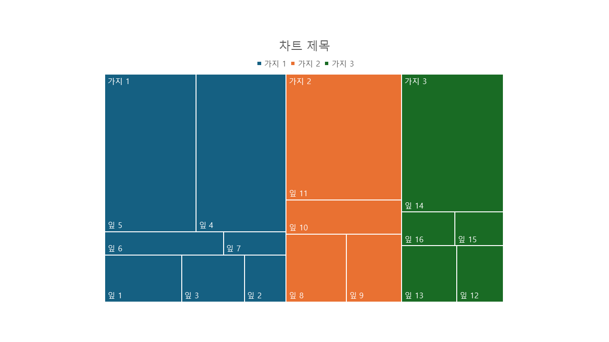 | <pre>**Chart type:** Treemap Chart<br><br>\|  \|  \|  \| 계열1 \|<br>\| --- \| --- \| --- \| --- \|<br>\| 가지 1 \| 줄기 1 \| 잎 1 \| 22 \|<br>\| 가지 1 \| 줄기 1 \| 잎 2 \| 12 \|<br>... (생략) ...<br>\| 가지 3 \| 줄기 6 \| 잎 16 \| 11 \|</pre>
**Slide 12 (Sunburst Chart)**<br>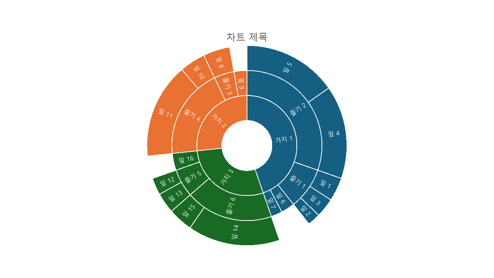 | <pre>**Chart type:** Sunburst Chart<br><br>\|  \|  \|  \| 계열1 \|<br>\| --- \| --- \| --- \| --- \|<br>\| 가지 1 \| 줄기 1 \| 잎 1 \| 22 \|<br>\| 가지 1 \| 줄기 1 \| 잎 2 \| 12 \|<br>... (생략) ...<br>\| 가지 3 \| 잎 16 \|      \| 21 \|</pre>
**Slide 13 (Clustered Column Chart)**<br>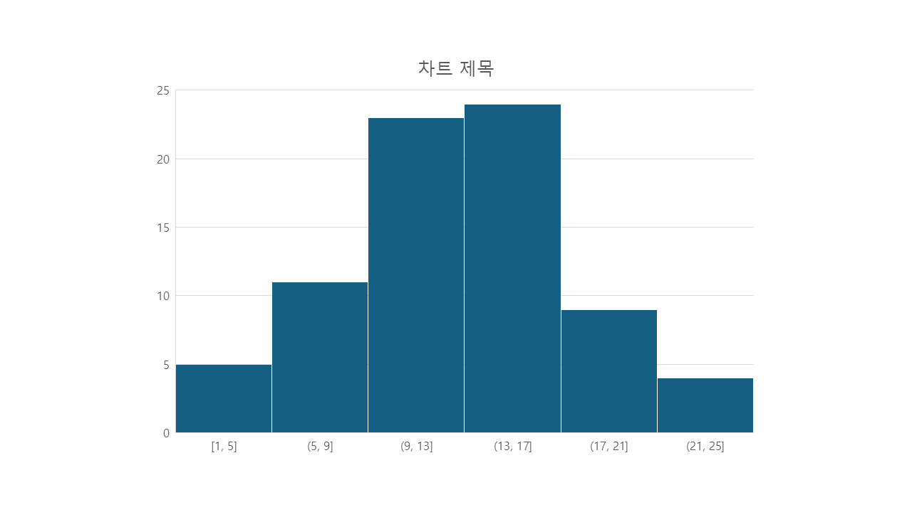 | <pre>**Chart type:** Clustered Column Chart<br><br>\| 계열1 \|<br>\| --- \|<br>\| 1 \|<br>\| 3 \|<br>... (생략) ...<br>\| 24 \|</pre>
**Slide 14 (Box & Whisker Chart)**<br>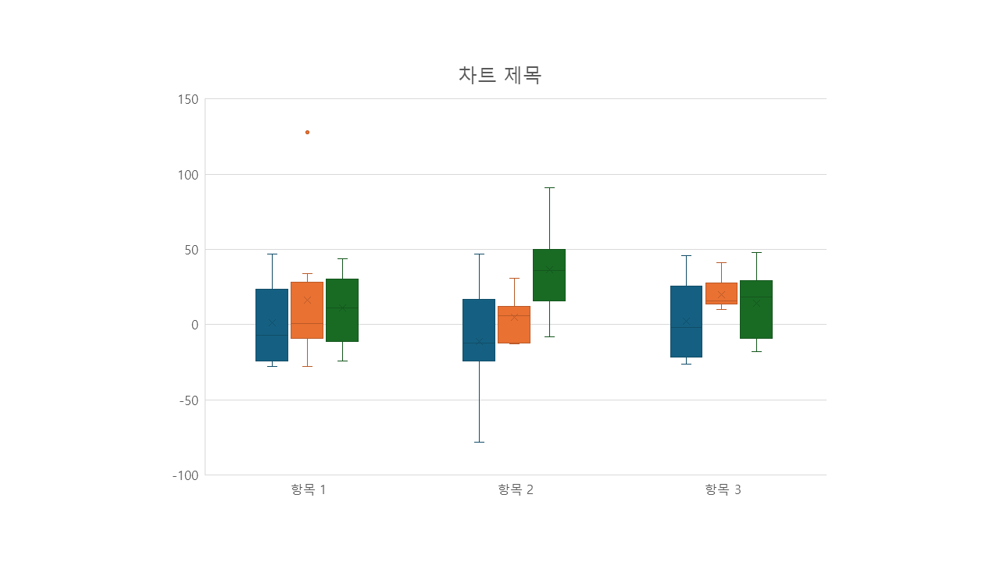 | <pre>**Chart type:** Box & Whisker Chart<br><br>\|  \| 계열1 \| 계열2 \| 계열3 \|<br>\| --- \| --- \| --- \| --- \|<br>\| 항목 1 \| -7 \| -3 \| -24 \|<br>\| 항목 1 \| -10 \| 1 \| 11 \|<br>... (생략) ...<br>\| 항목 3 \| -20 \| 16 \| -18 \|</pre>
**Slide 15 (Waterfall Chart)**<br>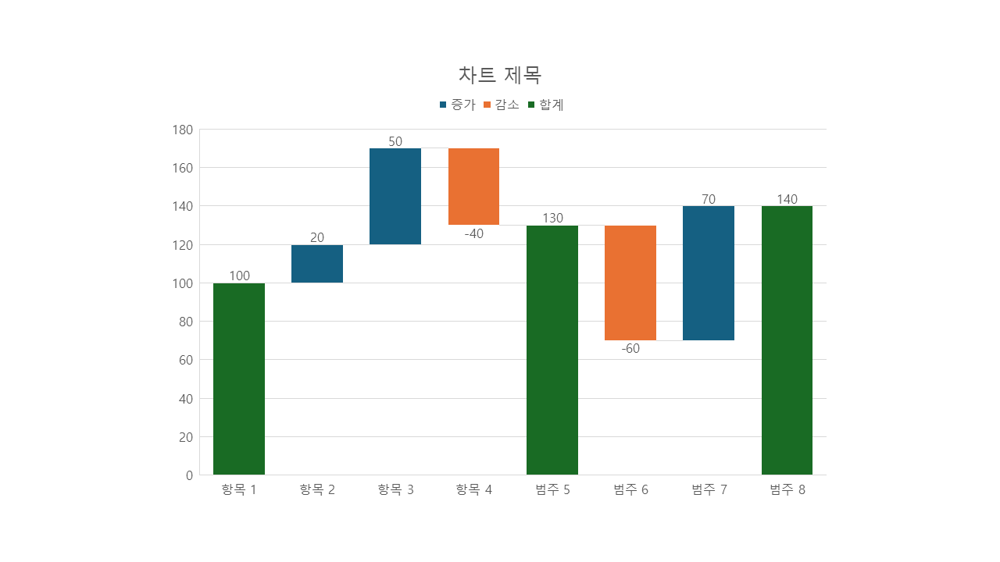 | <pre>**Chart type:** Waterfall Chart<br><br>\|  \| 계열1 \|<br>\| --- \| --- \|<br>\| 항목 1 \| 100 \|<br>\| 항목 2 \| 20 \|<br>... (생략) ...<br>\| 범주 8 \| 140 \|</pre>
**Slide 16 (Funnel Chart)**<br>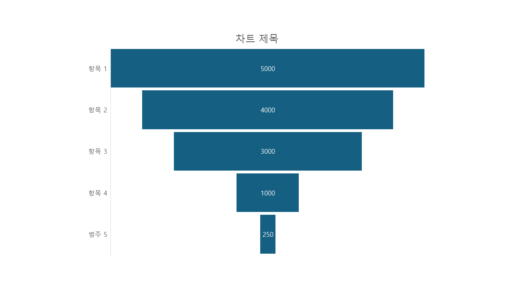 | <pre>**Chart type:** Funnel Chart<br><br>\|  \| 계열1 \|<br>\| --- \| --- \|<br>\| 항목 1 \| 5000 \|<br>\| 항목 2 \| 4000 \|<br>\| 항목 3 \| 3000 \|<br>\| 항목 4 \| 1000 \|<br>\| 범주 5 \| 250  \|</pre>
**Slide 17 (Combo Chart)**<br>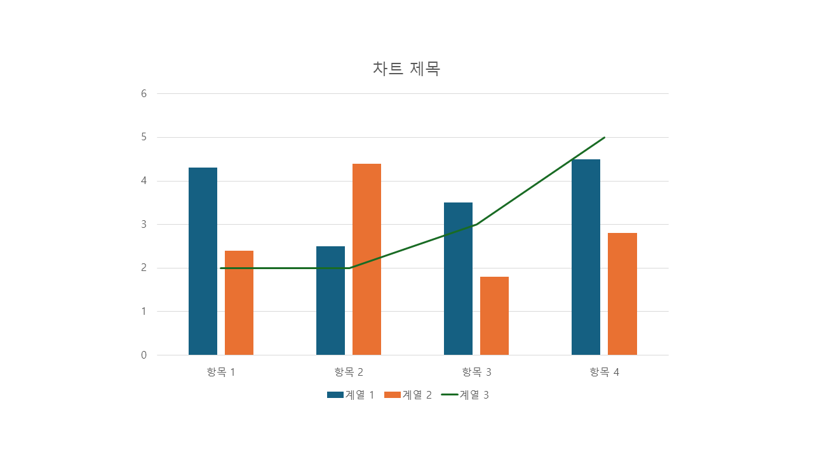 | <pre>**Chart type:** Column Chart, Line Chart<br><br>\|      \| 계열 1 \| 계열 2 \| 계열 3 \|<br>\| ---- \| ---- \| ---- \| ---- \|<br>\| 항목 1 \| 4.3  \| 2.4  \| 2    \|<br>\| 항목 2 \| 2.5  \| 4.4  \| 2    \|<br>\| 항목 3 \| 3.5  \| 1.8  \| 3    \|<br>\| 항목 4 \| 4.5  \| 2.8  \| 5    \|</pre>

---

## 지원 차트 타입

**전통 DrawingML (`c:chartSpace`):** 막대형, 꺾은선형, 원형, 영역형, 분산형, 거품형, 방사형, 주식형, 표면형 등

**현대 chartEx (`cx:chartSpace`):** 폭포형, 깔때기형, 트리맵, 선버스트, 히스토그램, 상자 수염형, 지역 맵, 파레토

## 데이터 소스 옵션

| 옵션 | 동작 |
|------|------|
| `xml` (전통 차트 기본값) | 파일에 내장된 DrawingML XML 파싱 |
| `excel` (chartEx 기본값) | 내장 `.xlsx` 워크북 읽기, 없으면 `xml` 폴백 |
